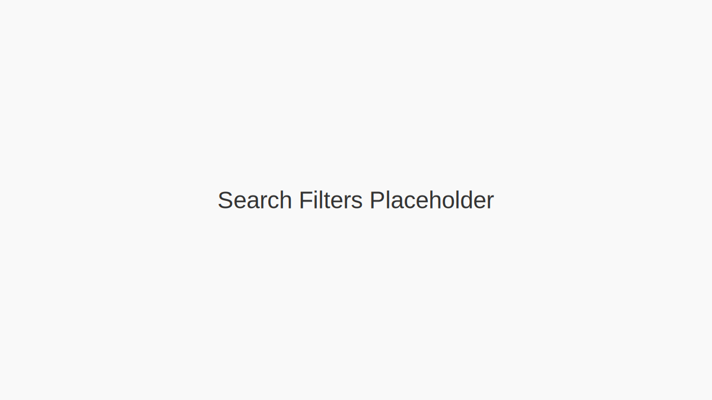
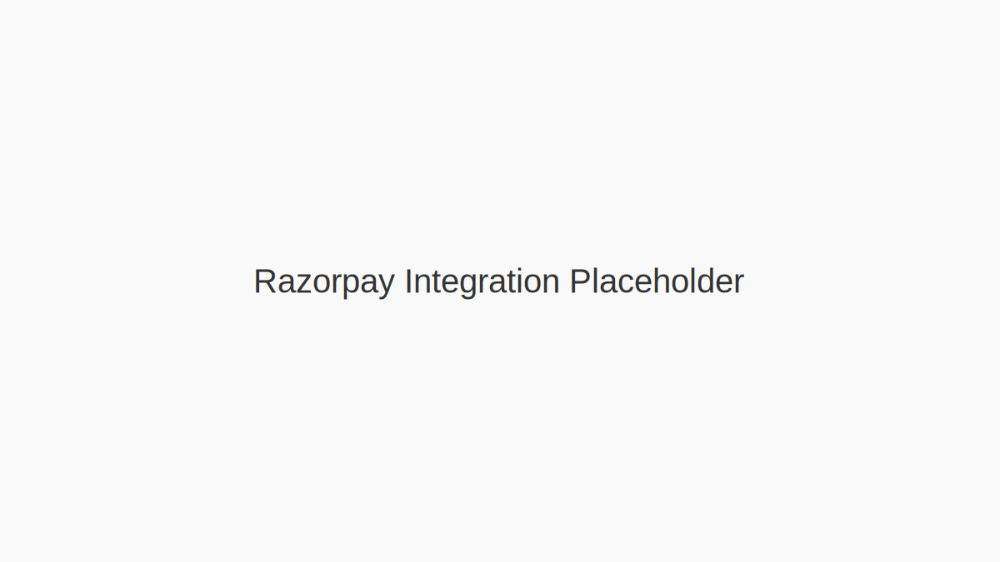

# 💍 Matrimonial Web Application

A professional, high-performance web platform for matrimonial services, built with Next.js 16, React 19, and Supabase.

---

## 🚀 Overview

The Matrimonial Web App provides a comprehensive suite of tools for users to find their perfect life partner.

**Live URL**: [https://matrimonial.ostechnologies.info](https://matrimonial.ostechnologies.info)

### 🌟 Key Features

- **🔐 Robust Authentication**: Secure user login and registration powered by Supabase Auth and Context API.
- **📊 Interactive Dashboard**: Real-time statistics, match recommendations, and activity tracking.
- **🔍 Precision Search**: Multi-parameter search filters including age, location, religion, and professional details.
- **💳 Payment Integration**: Secure Razorpay integration for premium membership plans.
- **👤 Profile Completion**: Intelligent profile completion tracking with real-time feedback.
- **📱 Fully Responsive**: Optimized for all devices using Tailwind CSS and mobile-first design.
- **🌓 Theme Support**: Built-in dark and light mode support using `next-themes`.
- **🛠 SQL-First Backend**: Robust PostgreSQL schema with triggers for automatic profile completion calculation.

---

## 🛠 Tech Stack

- **Framework**: [Next.js 16](https://nextjs.org/) (App Router)
- **Frontend**: [React 19](https://reactjs.org/), [TypeScript](https://www.typescriptlang.org/)
- **Styling**: [Tailwind CSS v4](https://tailwindcss.com/), [Shadcn UI](https://ui.shadcn.com/)
- **Backend**: [Supabase](https://supabase.com/) (PostgreSQL + Auth + Storage)
- **Forms**: React Hook Form + Zod Validation
- **Payments**: Razorpay API
- **Icons**: Lucide React
- **Deployment**: Docker & Docker Compose

---

## 🏗 Architecture

The project follows a modular structure using Next.js App Router:

```text
app/
├── api/                # Serverless API routes (Razorpay, Registration)
├── dashboard/          # Authenticated dashboard pages
│   ├── matches/        # Profile discovery
│   ├── payment/        # Subscription management
│   ├── profile/        # User profile settings
│   └── search/         # Advanced search interface
├── layout.tsx          # Root layout with providers
└── page.tsx            # Landing page
components/
├── ui/                 # Reusable Shadcn UI components
├── registration-modal.tsx
└── theme-provider.tsx
contexts/               # Global state (AuthContext)
lib/                    # Supabase client & utility functions
scripts/                # SQL migration scripts for database schema
```

---

## 📦 Installation

For detailed deployment strategies, environment variables, and live application URLs, please refer to the [Deployment Details](DEPLOYMENT_DETAILS.md) document.

### Prerequisites
- Node.js 20+
- Docker (optional, for containerized deployment)
- Supabase Project

### Steps
1. **Clone the repository**:
   ```bash
   git clone https://github.com/Rilan-Dev/Matrimonial-Web-App.git
   cd matrimonial-web
   ```

2. **Setup Environment Variables**:
   Create a `.env.local` file:
   ```env
   NEXT_PUBLIC_SUPABASE_URL=your_supabase_url
   NEXT_PUBLIC_SUPABASE_ANON_KEY=your_supabase_anon_key
   SUPABASE_SERVICE_ROLE_KEY=your_service_role_key
   NEXT_PUBLIC_RAZORPAY_KEY_ID=your_razorpay_key
   ```

3. **Install dependencies**:
   ```bash
   npm install
   ```

4. **Run Development Server**:
   ```bash
   npm run dev
   ```

5. **Docker Deployment**:
   ```bash
   docker-compose up --build
   ```

---

## 🗄 Database Schema

The platform uses a comprehensive PostgreSQL schema. Key highlights from `08-comprehensive-matrimonial-schema.sql`:
- **Profiles Table**: 60+ fields covering personal, family, religious, and lifestyle details.
- **Calculated Completion**: SQL function `calculate_profile_completion` automatically updates user progress.
- **Row Level Security (RLS)**: Strict data access policies ensuring privacy.

---

## 📸 Screenshots

| Landing Page | Search Interface | Payment Page |
|:---:|:---:|:---:|
|  |  |  |
| *Modern, conversion-focused UI* | *Advanced filtering system* | *Secure subscription checkout* |

---

## 🌐 Related Repositories

- **Mobile Application**: [Matrimonial-Mobile_App](../Matrimonial-Mobile_App)

---

## 🤝 Contribution Guidelines

1. **Fork** the repository.
2. **Create a feature branch**: `git checkout -b feature/amazing-feature`.
3. **Commit changes**: `git commit -m 'Add amazing feature'`.
4. **Push**: `git push origin feature/amazing-feature`.
5. **Open a PR**.

Please follow the ESLint and Prettier configurations.

---

## 📄 License

Distributed under the MIT License. See `LICENSE` for more information.
